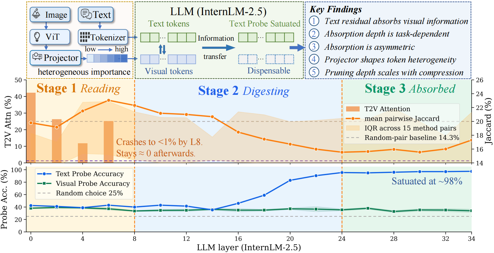
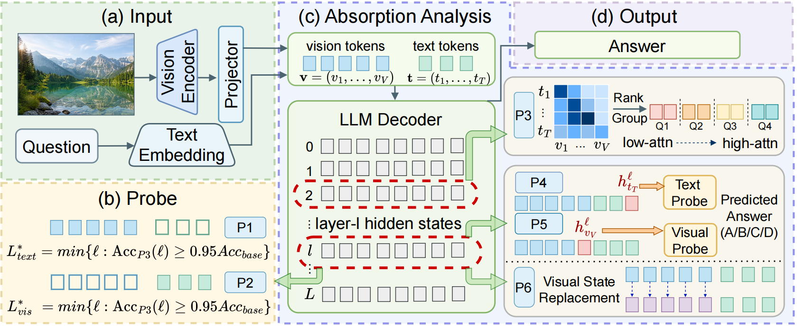

# When Do Visual Tokens Become Dispensable?

### A Symmetric Causal Analysis of Visual Information Absorption in Vision-Language Models

[](<./_Kai_Liu__NeurIPS_26_TokenAbsorption_VLM (2).pdf>)
[](#news)


[project](#) |
[arXiv](#) |
[supplementary material](#) |
[dataset](#) |
[pretrained models](#)

**Authors:** Kai Liu, Anqi Li, Ziqing Zhang, Zhixin Wang, Zhikai Chen, Renjing Pei, Yulun Zhang  


### 🔥🔥🔥 News

- **2026-05-09:** The report is released.

### Abstract
> Vision-Language Models (VLMs) process hundreds of visual tokens alongside text, yet it remains unclear *when* these tokens stop contributing useful information during the forward pass. We introduce a **symmetric interventional framework** of matched visual- and text-side zero-out, complemented by activation patching and a controlled projector swap as strict causal tests, to measure visual information absorption: the migration of visual content from visual tokens into the text residual stream. Across **seven VLMs** (linear, MLP, pixel-shuffle, and cross-attention projectors) and five benchmarks, we find that (i) visual information accumulates in text hidden states with absorption depth $\sim50\%$ on concept tasks and $\sim75\%$ on OCR and open-ended captioning, (ii) text-side zero-out recovers 2-8 layers *later* than visual-side, revealing layered absorption, (iii) projector design modulates spatial heterogeneity: tiled/pixel-shuffle projectors leave $75\%$ of visual tokens dispensable from layer 0, while simpler MLP/linear projectors smear content uniformly, and (iv) absorption depth scales monotonically with the compression ratio. A within-family Bunny projector swap further establishes that absorption is itself a design choice: the $S^2$-Wrapper variant matches task accuracy by routing visual content through attention read-out at the answer position rather than the text residual. The symmetric design exposes dynamics that single-sided ablations miss.
## 💡 Highlights

> TLDR: Visual information in InternVL-8B is progressively absorbed from visual tokens into text residual states. Text-to-vision attention collapses after early layers, while text-probe accuracy saturates near the final layers, indicating a transition from **reading** to **digesting** and finally to **absorbed**, where many visual tokens become dispensable.

## 📖 Methodology

> TLDR: TokenAbsorption measures when and where visual information is stored by applying matched visual- and text-side probes/interventions across LLM layers. The pipeline feeds image-text inputs through the vision encoder, projector, and LLM decoder, then uses layer-wise attention ranking, text/visual probes, and visual-state replacement to estimate absorption depth and test causal dependence.

## Key Findings

- **Finding 1**: Visual information concentrates in text residual
- **Finding 2**: Absorption depth is task-dependent
- **Finding 3**: Asymmetric recovery reveals layered absorption
- **Finding 4**: Projector complexity modulates spatial absorption heterogeneity
- **Finding 5**: Compression ratio scales monotonically with absorption depth

## 🛠 Preparation

Before running the absorption analysis, prepare the environment, model checkpoints, benchmark data, and activation cache directories. The full scripts and exact paths will be released with the code.

1. Clone the repository and create the environment.

```bash
git clone https://github.com/Kai_Liu001/TokenAbsorption.git
cd TokenAbsorption
conda create -n tokenabsorption python=3.10
conda activate tokenabsorption
pip install -r requirements.txt
```

2. Prepare pretrained VLM checkpoints.

Download the evaluated VLMs and place them under `checkpoints/` or set `MODEL_ROOT` to your local model directory. The analysis is designed for models with different projector families, including linear, MLP, pixel-shuffle, and cross-attention projectors.

```text
checkpoints/
├── internvl-8b/
├── bunny/
├── bunny-s2-wrapper/
└── ...
```

3. Prepare benchmark datasets.

Place each benchmark under `data/` with a unified image-question-answer format. The paper evaluates concept-centric VQA, OCR-oriented tasks, open-ended captioning, and ScienceQA-style multimodal reasoning.

```text
data/
├── scienceqa/
├── ocr/
├── captioning/
└── concept_vqa/
```

Each sample should provide an image path, text prompt/question, candidate choices when available, and the ground-truth answer used for accuracy/probe evaluation.

4. Prepare cache and output directories.

Layer-wise interventions and probes repeatedly access hidden states, attention maps, and projector outputs. We recommend caching activations before running full sweeps.

```bash
mkdir -p cache/activations outputs results figures
```

Expected cached artifacts include:

- Visual-token hidden states across LLM layers.
- Text-token residual states across LLM layers.
- Text-to-vision attention maps for ranking visual tokens.
- Projector outputs for heterogeneity and swap analysis.
- Model predictions and task accuracy under each intervention.

5. Verify the analysis configuration.

Each experiment should specify the model, benchmark, layer range, intervention type, probe target, and output directory. The core analysis compares matched visual-side and text-side operations so that absorption depth can be estimated consistently across tasks and models.

## TODO

- [ ] Release source code for intervention hooks.
- [ ] Release model wrappers for evaluated VLMs.
- [ ] Release benchmark preprocessing scripts.
- [ ] Release probing and aggregation scripts.
- [ ] Release figure reproduction scripts.
- [ ] Add exact environment file and dependency versions.


## 📎 Citation

If you find this work useful, please cite:

```bibtex
@article{liu2026tokenabsorption,
  title     = {When Do Visual Tokens Become Dispensable? A Symmetric Causal Analysis of Visual Information Absorption in Vision-Language Models},
  author    = {Liu, Kai and Li, Anqi and Zhang, Ziqing and Wang, Zhixin and Chen, Zhikai and  Pei, Renjing and Zhang, Yulun},
  booktitle = {arxiv},
  year      = {2026}
}
```

## 🔑 License

This project is released under the [Apache License 2.0](LICENSE).

## 👍 Acknowledgements
 We thank the open-source VLM community for releasing models, datasets, and tools that make this analysis possible. This work builds on prior efforts in multimodal representation analysis, causal intervention, activation patching, and efficient vision-language inference. We are grateful to the developers of InternVL, Bunny, and other evaluated VLMs for providing accessible model implementations. 
 We also thank the maintainers of benchmark datasets used for visual question answering, OCR reasoning, captioning, and multimodal science reasoning. Their contributions provide the foundation for studying how visual information is absorbed, transformed, and eventually made dispensable inside modern vision-language models.